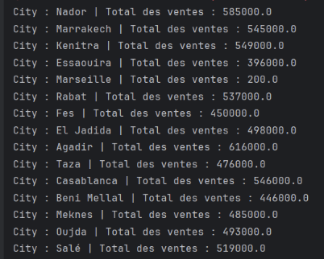
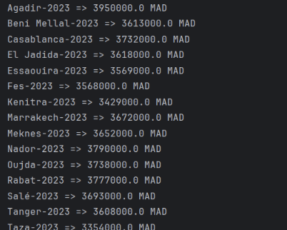

# TP Spark : Traitement parallèle et distribué

Ce projet contient deux applications Spark développées en Java. Elles réalisent des traitements parallèles sur un fichier de ventes, en local, avant exécution sur un cluster.

---

## 📁 Données d'entrée

Le fichier `sales.txt` contient les ventes de produits dans différentes villes au format suivant :
```csv
date,city,product,price
2023-01-05,Nador,Charger,10000.0
2023-01-04,Taza,Mouse,9000.0
2023-01-05,Kenitra,Smartphone,10000.0
 
```
--- 

## 🧩 Exercice 1 : Total des ventes par ville

L’application Spark lit le fichier `sales.txt` et calcule le total des ventes pour chaque ville.

### 💡 Étapes :
- Lire le fichier
- Supprimer l'en-tête
- Extraire le nom de la ville et le prix
- Grouper par ville et sommer les prix

📸 **Exécution** :



---

## 🧩 Exercice 2 : Total des ventes par ville et par année

Cette deuxième application Spark lit le fichier `sales.txt` et calcule le **prix total des ventes par ville et par année**.

### 💡 Étapes :
- Lire le fichier
- Supprimer l'en-tête
- Extraire la ville, la date (année) et le prix
- Grouper par (ville, année) et sommer

📸 **Exécution** :



---
